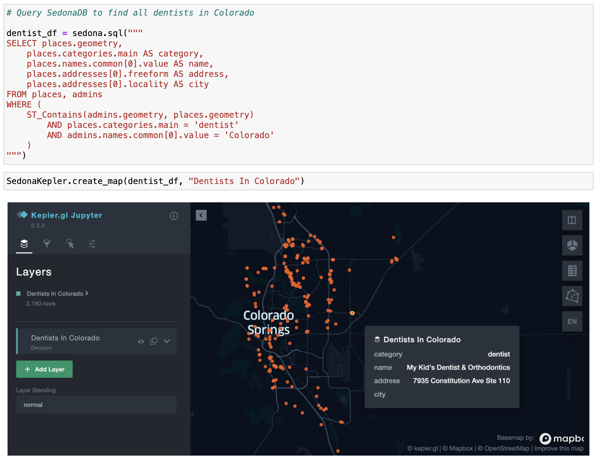
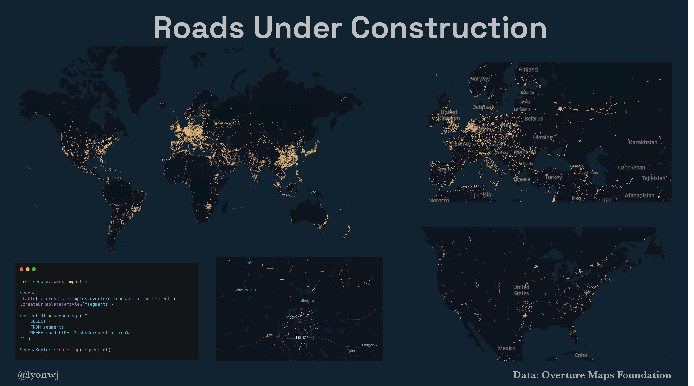
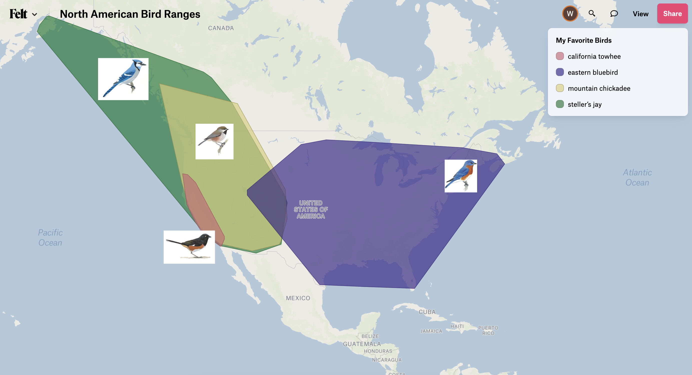
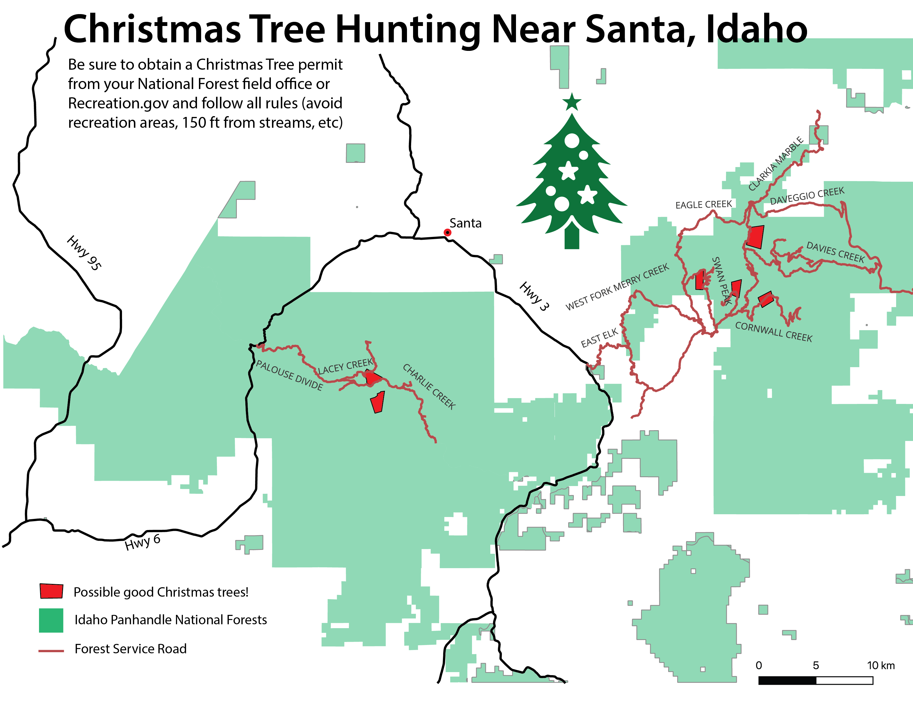

# 30 Day Map Challenge

## 1. Points

Now that everyone has their Halloween candy it's time to find a dentist near you!

* Data from [Overture Maps](https://medium.com/@dr.jiayu/harnessing-overture-maps-data-apache-sedonas-journey-from-parquet-to-geoparquet-d99f7767a499)
* Using [SedonaDB](https://wherobots.com/sedona-db/) on [Wherobots Cloud](https://www.wherobots.services)
* Code: [01-points.ipynb](notebooks/01-points.ipynb)

## 2. Lines

Did you know the Overture Maps road network data contains information about roads under construction?

* Data from [Overture Maps](https://overturemaps.org/) via [Wherobots open data catalog](https://docs.wherobots.services/1.2.0/tutorials/opendata/introduction/)
* Analysis using Using [SedonaDB](https://wherobots.com/sedona-db/) on [Wherobots Cloud](https://www.wherobots.services)
* Code: [02-lines.ipynb](notebooks/02-lines.ipynb)

## 3. Polygons

Calculating bird species range using data from Bird Buddy's smart bird feeders.

* Data from [Bird Buddy](https://mybirdbuddy.com/)
* Analysis using [SedonaDB](https://wherobots.com/sedona-db/) on [Wherobots Cloud](https://wherobots.com)
* Map created using [Felt](https://felt.com/) and uploaded using the [Felt API](https://feltmaps.notion.site/Felt-Public-API-reference-c01e0e6b0d954a678c608131b894e8e1) from Wherobots notebook environment
* Code: [03-polygons.ipynb](notebooks/03-polygons.ipynb)

## 7. Navigation

Finding the perfect Christmas tree using aerial imagery in QGIS and Forest Service Motor Vehicle User Map data!

* Data from [USFS Motor Vehicle User Maps](https://data-usfs.hub.arcgis.com/datasets/motor-vehicle-use-map-roads-feature-layer/explore)
* Analysis using [SedonaDB](https://wherobots.com/sedona-db/) on [Wherobots Cloud](https://wherobots.com)
* Map created using QGIS
* Code and tutorial: [07-navigation.ipynb](notebooks/07-navigation.ipynb)